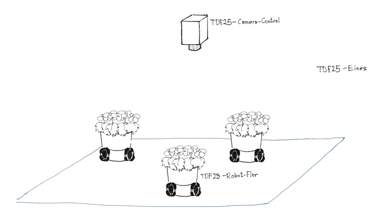

## La dansa dels testos

Projecte col·laboratiu del TAV (Tecnoateneu de Vilablareix) pel Temps del flors 2025.

El projecte no va tenir continuitat per la dificultat de posicionar els Robots-Flors de manera controlada i repetitiva. No està acabat.

### Estructura

El projecte està estructurat en 4 repositoris:
- [La-dansa-dels-testos](): Repositori general, aquest.
- [TDF25-Robot-Flor-Mecanica](https://github.com/tecnoateneu/TDF25-Robot-Flor-Mecanica): Repositori amb l'informació mecànica del robot.
- [TDF25-Robot-Flor-Software](https://github.com/tecnoateneu/TDF25-Robot-Flor-Software): Repositori amb l'informació de software del robot.
- [TDF25-Camera-Control](https://github.com/tecnoateneu/TDF25-Camera-Control): Repositori amb tota la informació de la Raspberry que controla tots els Robots-flors
- [TDF25-Eines](https://github.com/tecnoateneu/TDF25-Eines): Repositori amb la informació de les eines accessòries que corren sobre PC o similar.
